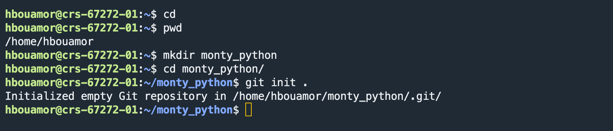
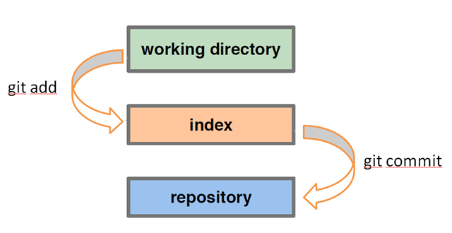
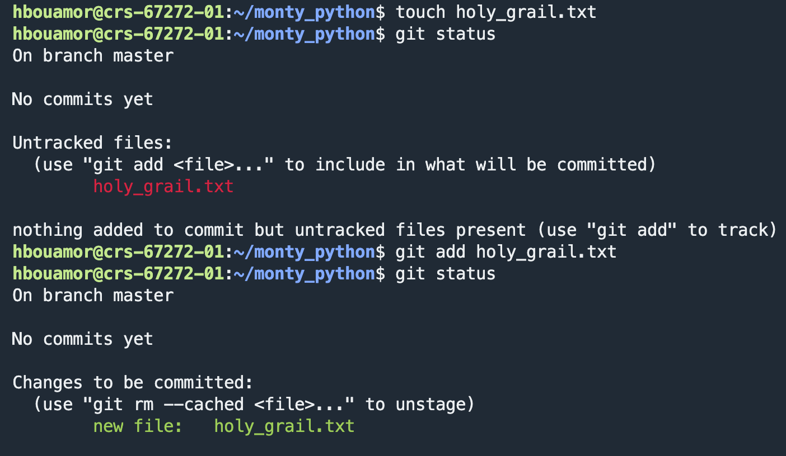
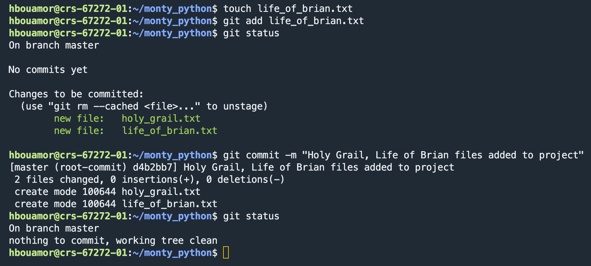
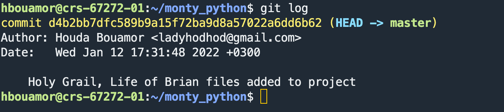
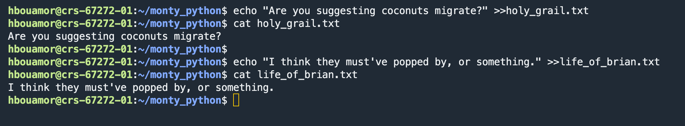
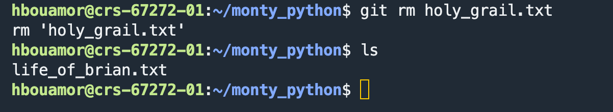
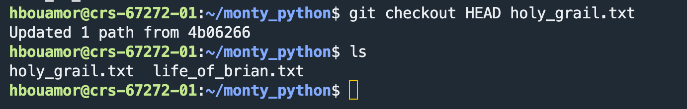
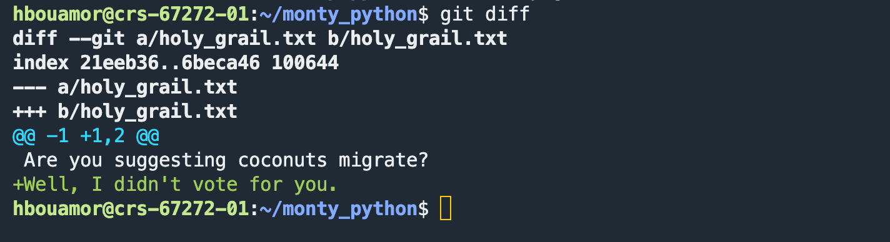
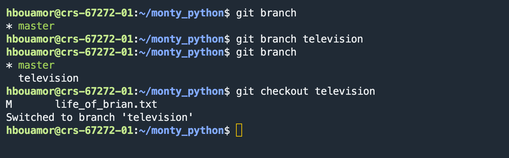

Lab 1: Setup; Using Git
=

Objectives:
=

- Get the setup needed to build applications
- Configure Git
- Learn basic Git functions through exercises
- Learn Basic command line 

Due Date:
= 
**January 13, 2022** by the end of the lab session :)

Important Note
= 
 In this lab, you have a total of **3 checkpoints** to validate with one of the teaching team members. 
 
Checkpoints will be graded as follows:

* Checkpoint 1: 40 points
* Checkpoint 2: 30 points
* Checkpoint 3: 30 points

Part 1: Setup
========

Please refer to one of the documents in this Git Repository depending on the Operating System you have.

- If you have a Mac, please follow the instructions in **Mac\_Lab1\_setup.pdf**
- If you have a Windows machine, please follow the instructions in **Windows\_Lab1\_setup.pdf**
- Make sure you find your server name as well as the port to be used in **67272\_Servers\_Ports.pdf**. You will be using this server during this semester. So save it!

*  *  *  *  *
#  Stop!   1. Show a TA/CA that you have completed this part by showing your localhost:3000 rails splash page.
*  *  *  *  *

Part 2: Using Git; Command Line
========
#### Installing Git in your machine
1. If you would like to install Git locally on your Mac, you can get a download at [https://git-scm.com/download/mac](https://git-scm.com/download/mac). Install Git by following the instructions provided. Then, please be sure Git is installed properly before continuing by typing `git` in the command line (Terminal).
2. There are a number of graphical user interfaces available for Git if you installed locally on a Mac, but using the command line to manage Git is easy and will be what we use for all lab instructions. For the remainder of the lab today, we recommend you use the command line (Terminal).

#### Configuring Git
1. There are a number of online resources for Git. There is a nice cheat sheet [here](http://cheat.errtheblog.com/s/git). Open one of these now in a browser for reference purposes. Also note some nice Git resources at [www.gitready.com](http://www.gitready.com) that might also be helpful later in the course.

2. Setup your git installation with your author information. That way, when you make a commit, you are "signing" it so other developers know who made the commit.
In Tabby/Hyper/MobaXterm (depending on the terminal you are using), type the following:

        git config --global user.name "Your Name"
        git config --global user.email "your@email.address"

    **Note**: The quotations are important.

#### Getting Started with Git
To get a feel for how Git works without getting bogged down by code, we are going to set up some simple text files with material from various Monty Python movies and skits.  

1. Navigate to your home directory. (i.e., /home/andrewID) using `cd`. `cd` stands for "Change Directory". It used to change the current working directory in Linux and other Unix-like operating systems. It is one of the most basic and frequently used commands when working on the terminal.

		cd 
2. Make sure you are in your home directory using `pwd`. pwd command stands for Print Working Directory. It prints the full pathname of the current working directory to the standard output.

		pwd 		
	
3. Start by creating a folder or directory somewhere called 'monty_python' 

		mkdir monty_python
			
4. Switch into that directory

		cd monty_python

5. Now in that directory, we will create a new git repository by typing:

        git init

  Here is a screenshot to help:
  

To save files to a Git repo (shorthand for repository), we need to understand that Git works in a two-step process. First we send files from our working directory to a staging level. Once we have a collection of related files in staging we want to save to the repo, we 'commit' those files along with a useful message explaining what was committed. Later if we ever want a file or set of files back from the repository, we can do so using the 'checkout' process. The diagram below summarizes this:

6. Within your working directory, create an empty file called `holy_grail.txt` unsing the `touch` command. `touch` is used to create a file without any content:

		touch holy_grail.txt
7. Now check that the file is untracked and needs sent to staging:

        git status

8. Add the file to the staging area:

        git add holy_grail.txt

  **Tip** - You can hit <TAB> (the tab key) to autocomplete filenames and directories.

9. Type `git status` again and verify that the file is ready to commit.

  Here's a screenshot that may be helpful:
  

10. Following the same previous steps, add another file called `life_of_brian.txt` to the working directory.

11. Commit the files in staging to the repository:

        git commit –m "Holy Grail, Life of Brian files added to project"

  **Tip** - good messages are useful; always include a description message using the –m flag!

12. Confirm the change by running `git status`. 

  
  
13. Double check the change by running `git log` to see the list of commits.

	

14. To make sure you have this git stuff down, do the following:

  a. Add one quote from each movie to its respective file as follows:
    - Holy Grail:  [https://www.pastemagazine.com/movies/monty-python/monty-python-and-the-holy-grail-best-quotes/)
    - Life Of Brian: [https://www.rottentomatoes.com/m/monty_pythons_life_of_brian/quotes/)
    
> 	    echo "Are you suggesting coconuts migrate?" >>holy_grail.txt
> 		cat holy_grail.txt
> 	    
> 	    echo "I think they must've popped by, or something." >>life_of_brian.txt    
> 	    cat life_of_brian.txt
	    
  
   
   
   **Note:** Do not forget to stage and commit the modifications!

  b. Add a new file called `completely_different.txt` to the repository. 
  Refer back to the previous instructions if necessary.

*  *  *  *  *
#  Stop!   2. Show a TA/CA that you have completed this part.

*  *  *  *  *

#### Diffing and Removing Files
Now that we have a basic Git repository set up and know how to add files, we need to also learn how to remove files and how to compare versions of the same file in different levels. Let's start with removal. In the git status help, we saw the note that if we want to remove a file from the staging level.

1. Remove the `holy_grail.txt` by typing the following:

        git rm holy_grail.txt

  and verify that it's gone from your working directory using the `ls` command. The `ls` command is used to list files or directories in Linux and other Unix-based operating systems. Just like you navigate in your File explorer or Finder with a GUI (Graphical User Interface), the `ls` command allows you to list all files or directories in the current directory by default, and further interact with them via the command line.
  
  		 ls
  		
  	

2. **Oh snap!** We didn't want to delete the file! I meant to use `git rm --cached`. Don't worry, it hasn't been removed from the repository yet - we've just *marked* the file for deletion.

3. Get the file back by using `checkout`:

        git checkout HEAD holy_grail.txt

  **Note** - `HEAD` is a pointer to your most recent commit. This could also be the SHA value of any previous commit.
  
  

4. Add another famous quote to `holy_grail.txt`.

	`echo "Well, I didn't vote for you." >>holy_grail.txt`

5. Use git diff to see what has changed:

        git diff

  

6. Stage and commit these changes:

        git add holy_grail.txt
        git commit -m "Added another quote to holy_grail.txt"

7. Add another quote to `life_of_brian.txt` and stage the file (`git add life_of_brian.txt`), but **do not commit**.

	`echo "Always look on the bright side of life." >>life_of_brian.txt`

8. Run git diff:

        git diff

  You should not see any output. This is because the changes are staged and ready to be committed. If you want to see the difference between the staged version and the repository version, specify the `--cached` flag:

      git diff --cached life_of_brian.txt

9. Reverse your changes to `life_of_brian.txt`:

        git rm --cached life_of_brian.txt

10. We have decided that the `completely_different.txt` file was unnecessary. Using git, remove the file. (On your own - see a TA if you need assistance)

#### Branching and Merging
We need to add the new material from the Flying Circus to our project and to do this we will branch the project (if we don't like the changes, it will be very easy to just kill the branch and go back to master and try again – great way to safely experiment within the project).

Git branching allows developers to create branches to work with a copy of the code without modifying the existing version. You create branches to isolate your code changes, which you test before merging to the main branch. 

1. List all our current branches with:

        git branch

  The current (and only) branch is marked with a `*`.

2. Create a new branch called "television":

        git branch television

3. Run `git branch` again to verify the branch exists.

4. Switch to the `television` branch:

        git checkout television

  

5. Add a new file called `flying_circus.txt` with the quote:

    > "No one expects the Spanish Inquisition!"

  Add this file to the repository with an appropriate message.

6. Return to the `master` branch:

        git checkout master

  You'll notice that the `flying_circus.txt` file disappeared! Not to worry - it will be back soon enough.

7. Create and switch to a new branch called "movies":

        git checkout -b movies

  **Tip** - in command, we created the branch and switched to it in one command by specifying the `-b` flag to `git checkout`.

8. On this new branch, add two new files:

        touch meaning_of_life.txt mp_live.txt

9. Stage and Commit these two files using what you learned earlier in the lab.

10. Checkout the master branch again (see previous commands for help).

11. Merge the `movies` branch back into the `master` branch:

        git merge movies

  **Note** - the branch `movies` still exists. If it's no longer needed, delete the branch with:

        git branch -d movies

12. Checkout the `television` branch.

  Notice that the new movie files are gone, but the `flying_circus.txt` is back in the working directory.

13. Add a new quote to `flying_circus.txt` (anything will do), stage and commit the change to the repository.

14. Merge the `television` branch back into the `master` branch (see #10..#11 for help).

15. Run the `git log` command to explore all the changes tracked in the repo.

There is obviously much more to Git, but this lab should get you familiar with the basics and started using Git and your proficiency should increase as you use it more in this course. Once the TA verifies the repo is set up, you are done with this ;a.

*  *  *  *  *
#  Stop!   3. Show a TA/CA that you have finished this lab. The TA/CA will check your git log for the history of your git activity.

*  *  *  *  *

On your Own
===========
This week for the "on your own" section, your job is to review HTML, CSS, and basic JavaScript as needed. If you don't remember much from HTML & CSS, please refer to w3schools to brush up these skills.
